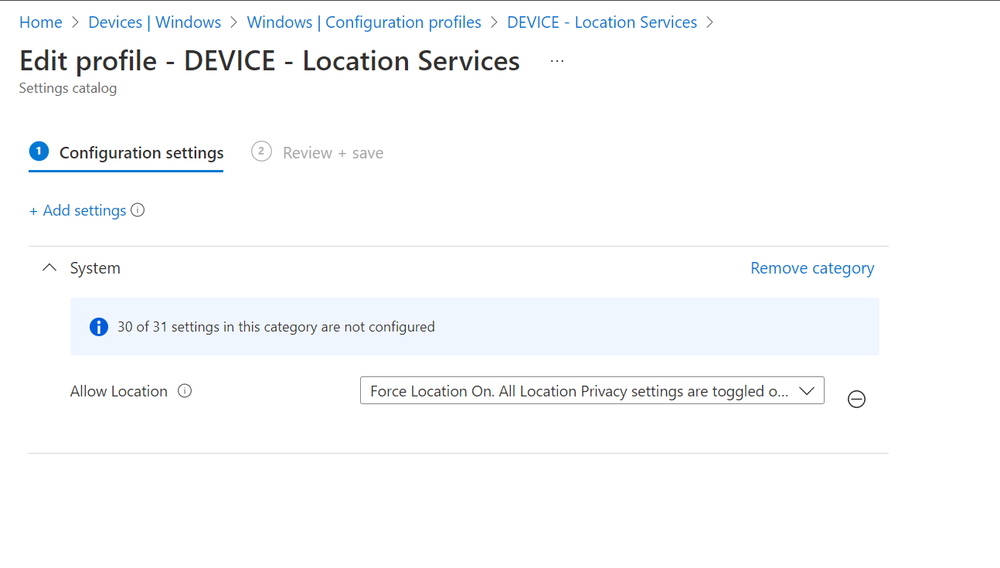

# Enable Automatic Timezones 
## Pre-Requisites
**_There is 1 pre-requisite for this PR Set._**

This script requires that a Configuration Profile is deployed with the following:

`Settings Catalog/System/Allow Location`:

> `Force Location On. All Location Privacy settings are toggled on and grayed out. Users cannot change the settings and all consent permissions will be automatically suppressed.`

**Note:** More specific control of the location settings may be applied, but this is outside the scope of this PR set.

  
  

